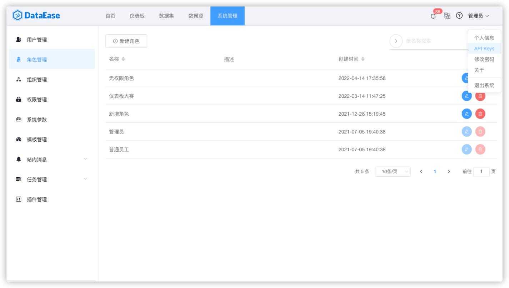
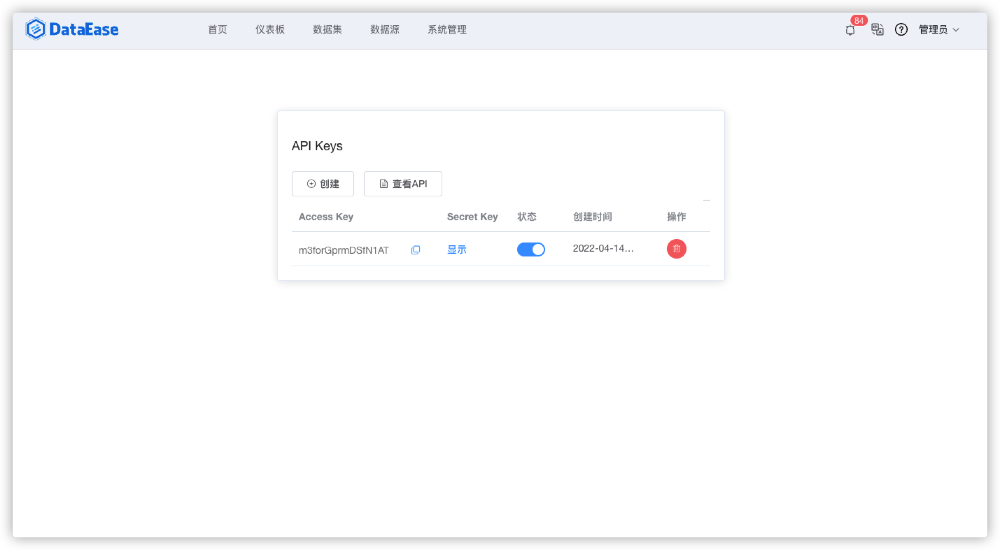
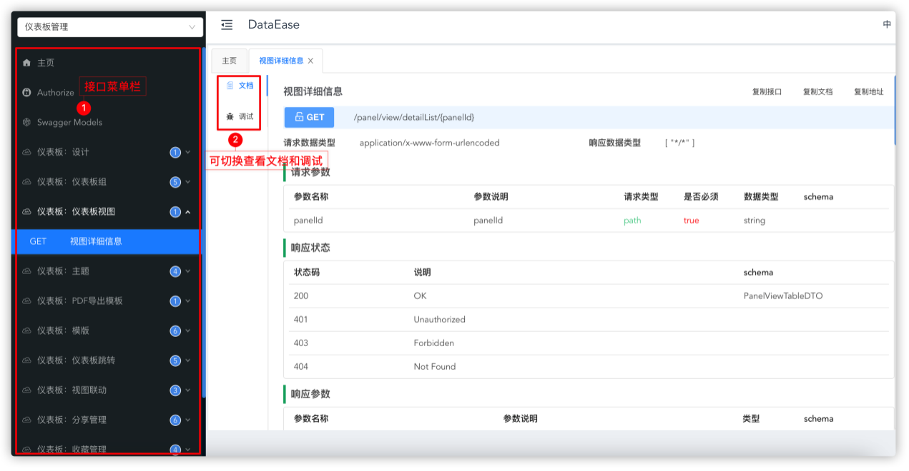

##1 集成与扩展入口

!!! Abstract ""
    API Keys 是用户获取 Keys 来调试接口的入口，用户可通过【创建】获取到 API Key，点击 "API Keys" 可查阅 DataEase 相关接口。

{ width="900px" }

{ width="900px" }

##2 集成与扩展接口
!!! Abstract ""
    可供调试的接口如下图所示。

{ width="900px" }