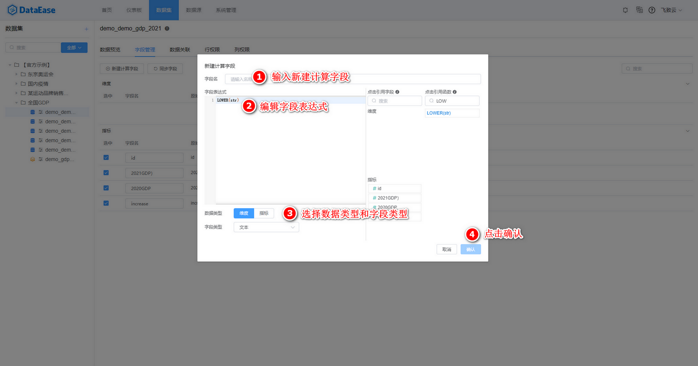
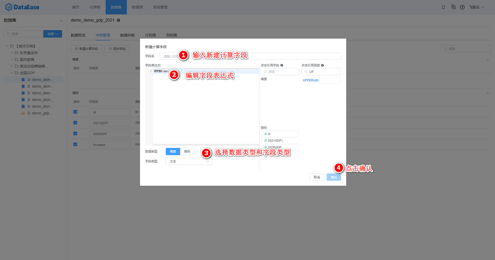
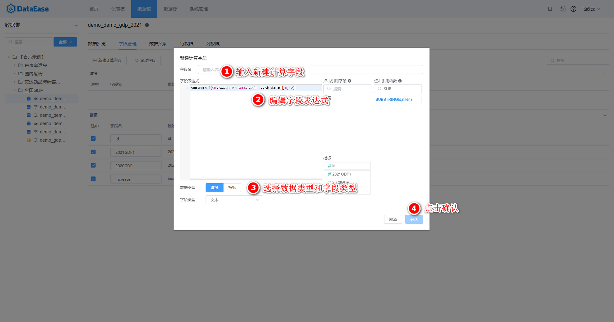
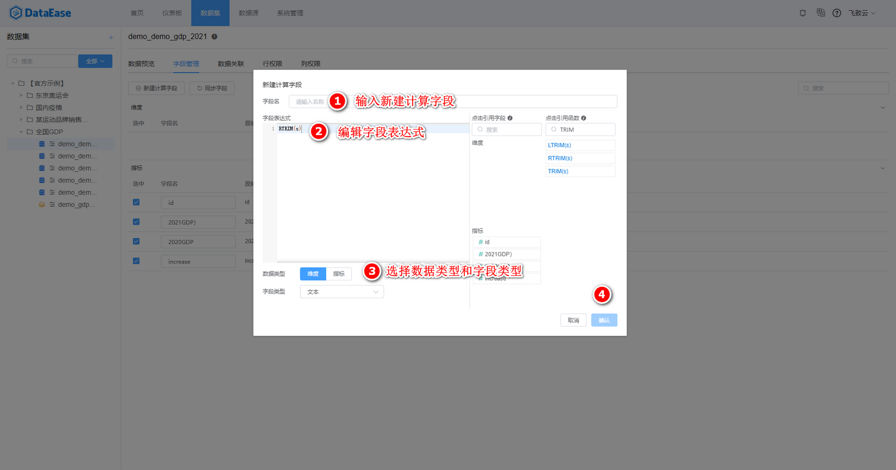
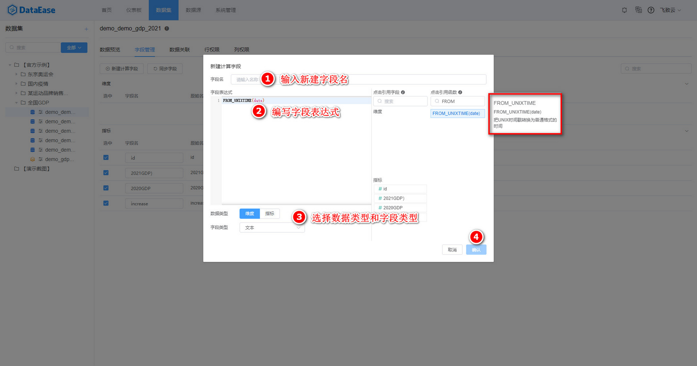
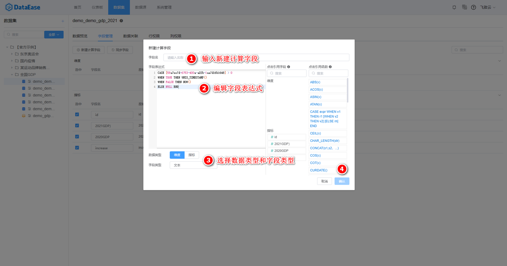
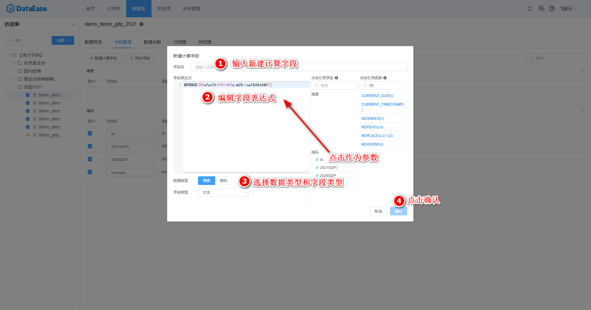
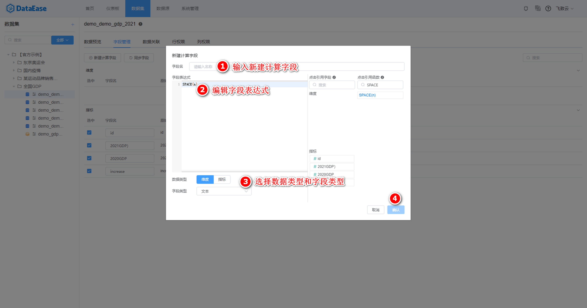
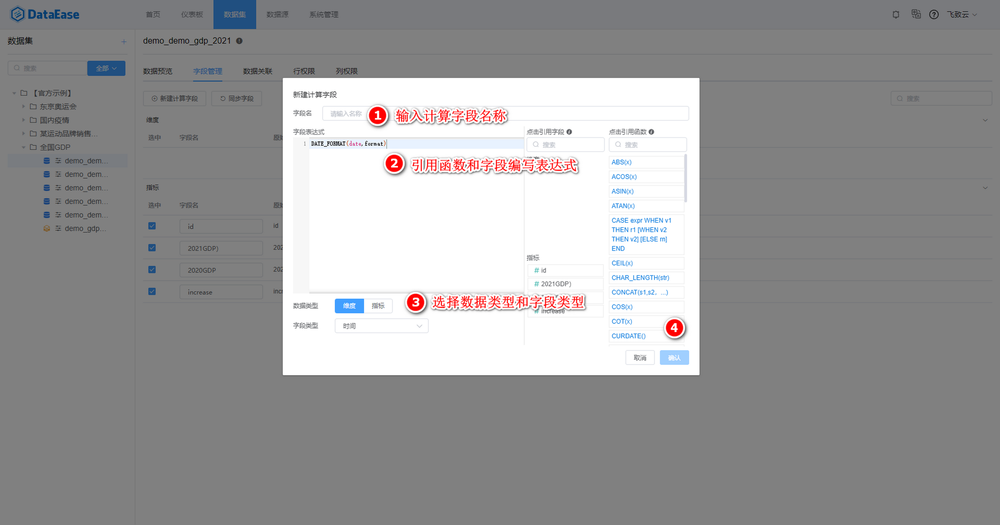

## 计算字段概述

!!! Abstract ""
    【计算字段】是数据集的重要模块之一，支持可在当前数据集字段的基础上通过公式或函数生成新的字段，丰富了数据集的字段内容。  

[//]: # (![image.png]&#40;../img/calculate_fields/新建计算字段-选择字段.png&#41;{width="900px"})

[//]: # (![image.png]&#40;../img/calculate_fields/新建计算字段-求和.png&#41;{width="900px"})

## 函数入门
### 新建步骤

!!! Abstract ""
    在计算字段管理中。点击【新建计算字段】按钮会有弹窗，需要依次输入新建计算字段的"字段名"、"数据类型"、"字段类型”和"字段表达式"完成新建。
{width="900px"}

### 函数和参数

!!! Abstract ""
    图中字符表达式是由函数和参数构成。函数的用法可通过鼠标悬浮在函数上查看，函数之间可以组合使用。函数参数的数字类型一般用 x 表示，字符类型用 str、s 表示，条件表达式用 expr 表示。

{width="900px"}

!!! Abstract ""
    **使用数据集对应数据库类型所支持的函数，语法同对应数据库；**  
    如日期格式化：  

    - MySQL 使用 DATE_FORMAT(date,format)；
    - Oracle 使用 TO_DATE(X,[,fmt])；
    - 非直连模式数据集，使用 Doris 数据库函数。

!!! info "下面会以非直连数据集为例介绍常用的函数信息，其他函数可参考 Doris 官网 https://doris.apache.org/zh-CN/。"

# 非直连数据集
## 字符串函数
### 1.大小写转换

!!! Abstract ""
    LOWER(str)：将 str 中的字母全部转换成小写，其中 str 需根据需要选择维度或指标中的一个字段。

{width="900px"}

!!! Abstract ""
    UPPER(str)：将字符串中的字母全部转换成大写，其中 str 需根据需要选择维度或指标中的一个字段。注意：str 是字符串类型。

{width="900px"}

### 2.截取字符

!!! Abstract ""
    SUBSTRING(s,n,len)：获取从字符串 s 中的第 n 个位置开始长度为 len 的字符串，其中 s 需根据需要选择维度或指标中的一个字段。注意：s 是字符串类型，n 和 len为正整数。

{width="900px"}

### 3.替换字符

!!! Abstract ""
    REPLACE(s,s1,s2)：返回一个字符串，用字符串 s2 替代字符串 s 中所有的字符串 s1，其中 s 需根据需要选择维度或指标中的一个字段。注意：s、s1、s2 是字符串类型。

.png){width="900px"}

### 4.去除空格

!!! Abstract ""
    LTRIM(s)去除左边空格：返回字符串 s，其左边所有空格被删除，其中 s 需根据需要选择维度或指标中的一个字段，下图展示了用指标中的"用户 id" 作为参数 s。
   

{width="900px"}

!!! Abstract ""
    RTRIM(s)去除右边空格：返回字符串 s，其右边所有空格被删除，其中 s 需根据需要选择维度或指标中的一个字段。

{width="900px"}

!!! Abstract ""
    TRIM(s)去除俩边空格：返回字符串 s 删除了两边空格之后的字符串，其中 s 需根据需要选择维度或指标中的一个字段。

{width="900px"}

## 时间函数
### 1.返回当前时间

!!! Abstract ""
    NOW()：返回当前日期和时间值，格式为 "YYYY_MM-DD HH:MM:SS" 或 "YYYYMMDDHHMMSS"，具体格式根据函数用在字符串或数字语境中而定，不带参数的函数直接返回即可。具体步骤按照下图所示。

.png){width="900px"}

!!! Abstract ""
    LOCALTIME()：返回当前日期和时间值，格式为 "YYYY_MM-DD HH:MM:SS" 或 "YYYYMMDDHHMMSS"，具体格式根据函数用在字符串或数字语境中而定。具体步骤按照下图所示。

.png){width="900px"}

!!! Abstract ""
    CURDATE()：将当前日期按照 "YYYY-MM-DD" 或者 "YYYYMMDD" 格式的值返回，具体格式根据函数用在字符串或是数字语境中而定。具体步骤按照下图所示。

.png){width="900px"}

!!! Abstract ""
    CURRENT_DATE()：将当前日期按照 "YYYY-MM-DD" 或者 "YYYYMMDD" 格式的值返回，具体格式根据函数用在字符串或是数字语境中而定。具体步骤按照下图所示。

.png){width="900px"}

!!! Abstract ""
    UNIX_TIMESTAMP()：返回一个格林尼治标准时间 1970-01-01 00:00:00 到现在的秒数。具体步骤按照下图所示。

.png){width="900px"}

!!! Abstract ""
    UNIX_TIMESTAMP(date)：返回一个格林尼治标准时间 1970-01-01 00:00:00 到指定时间 date 的秒数。其中 date 需根据需要选择维度或指标中的一个字段。注意：date 是时间类型。具体步骤按照下图所示。

.png){width="900px"}

### 2.日期转换
!!! Abstract ""
    FROM_UNIXTIME(date)：将时间戳转换为时间，默认格式为 ‘%Y-%m-%d %H:%i:%s’，依据数据库类型的不同对应的使用方法也有差异。

{width="900px"}

## 数字运算

.png){width="900px"}

### 1.绝对值函数

!!! Abstract ""
    ABS(x)：返回 x 的绝对值。其中 x 需根据需要选择维度或指标中的一个字段或指定数字。注意：x 是数字类型。

.png){width="900px"}

### 2.乘方

!!! Abstract ""
    POW(x,y)：x 的 y 次方 ，返回 x 的 y 次乘方的值。其中 x 和 y 需根据需要选择维度或指标中的一个字段或指定数字或指定数字。注意：x和y 是数字类型。

.png){width="900px"}

!!! Abstract ""
    EXP(x)：返回 e 的 x 乘方后的值。其中 x 需根据需要选择维度或指标中的一个字段或指定数字或指定数字。注意：x 是数字类型。

.png){width="900px"}

### 3.余数
!!! Abstract ""
    MOD(x,y)：返回 x 被 y 除后的余数。其中 x，y 可需根据需要选择维度或指标中的一个字段或指定数字。注意：x，y 是数字类型。

### 4.取整

!!! Abstract ""
    CEIL(x)向上取整 ：返回不小于 x 的最小整数。其中 x 需根据需要选择维度或指标中的一个字段或指定数字或指定数字。注意：x 是数字类型。

.png){width="900px"}

!!! Abstract ""
    FLOOR(x)向下取整 ：返回不大于 x 的最大整数。其中 x 需根据需要选择维度或指标中的一个字段或指定数字或指定数字。注意：x 是数字类型。

.png){width="900px"}

!!! Abstract ""
    ROUND(x)就近取整 ：返回离 x 最近的整数。其中 x 需根据需要选择维度或指标中的一个字段或指定数字或指定数字。注意：x 是数字类型。

.png){width="900px"}

### 5.PI()常数

!!! Abstract ""
    PI()：返回圆周率 π，默认显示 6 位小数。

.png){width="900px"}

### 6.三角函数

!!! Abstract ""
    COS(x)：返回 x 的余弦，其中 x 为给定的弧度值。对应的还有其他三角函数，比如 SIN(x)。其中 x 需根据需要选择维度或指标中的一个字段或指定数字或指定数字。注意：x 是数字类型。

.png){width="900px"}

## 逻辑函数

### 1.IF函数
!!! Abstract ""
    在进行数据分析时，用户经常会使用到 IF 判断条件，来对已有的数据进行数据清洗和处理。
    在IF函数中，如果 expr 是 TRUE 则返回 v1，否则返回 v2。注意：expr 是表达式，v1 和 v2 是确定的返回值。

{width="900px"}

{width="900px"}

### 2.CASE-WHEN函数

!!! Abstract ""
    CASE-WHEN 函数和 IF 的用法类似，区别是对于条件表达式的返回值，CASE-WHEN更加细化（除了能对 v1 和 v2 俩个返回值有不同的结果外，还能对第三种返回值有 rn 的结果），表达式之间也支持嵌套使用。
    注意：expr 是表达式，v1 和 v2 是确定的返回值。

{width="900px"}

!!! info "下面会介绍 MySql 数据库特有的常用的函数，注意：有部分 MySql 的函数和非直连数据集重合的需要参考非直连数据库。"

# MySql 数据库
## 字符串函数
### 1.字符反转函数

!!! Abstract ""
    REVERSE(s)：将字符串 s 反转，其中 str 需根据需要选择维度或指标中的一个字段。注意：str 是字符串类型。
    

{width="900px"}

!!! Abstract ""
    LEFT(s,n)：返回字符串 s 从最左边开始的 n 个字符，其中 s 需根据需要选择维度或指标中的一个字段。注意：s 是字符串类型，n 是正整数。

.png){width="900px"}

!!! Abstract ""
    INSERT(s1,x,len,s2)：返回字符串 s1，其子字符串起始于位置 x，被字符串 s2 取代 len 个字符。注意：s1 和 s2 是字符串类型，x 和 len 为正整数。

.png){width="900px"}

!!! Abstract ""
    REPEAT(s,n)：返回一个由重复字符串 s 组成的字符串，字符串s的数目等于 n。其中 s 需根据需要选择维度或指标中的一个字段。注意：s 是字符串类型，n 为正整数。

.png){width="900px"}

### 2.拼接空格字符

!!! Abstract ""
    数据库类型数据集特有SPACE(n)：返回一个由 n 个空格组成的字符串，如下图展示顶一个计算字段是有 8 个空格的。
    
    **提示：此函数可用于对字符串拼接空格使用。**

{width="900px"}

!!! Abstract ""
    SYSDATE()：返回当前日期和时间值，格式为 "YYYY_MM-DD HH:MM:SS" 或 "YYYYMMDDHHMMSS"，具体格式根据函数用在字符串或数字语境中而定。具体步骤按照下图所示。

.png){width="900px"}

## 日期函数

### 1.返回当前时间
!!! Abstract ""
    SYSDATE()：返回当前日期和时间值，格式为 "YYYY_MM-DD HH:MM:SS" 或 "YYYYMMDDHHMMSS"，具体格式根据函数用在字符串或数字语境中而定。具体步骤按照下图所示。
    
    **提示：NOW() 函数始终获取的是 SQL 语句开始执行的时间，而 SYSDATE() 函数则是动态获取的实时时间。**

.png){width="900px"}

### 2.日期转换
!!! Abstract ""
    DATE_FORMAT(date,format)日期转换函数。

{width="900px"}

## 对数

!!! Abstract ""
    LOG(x)：返回 x 的自然对数，x 相对于基数 e 的对数。其中 x 需根据需要选择维度或指标中的一个字段或指定数字。注意：x 是数字类型。

.png){width="900px"}

!!! info "下面会介绍 Oracle 数据库特有的常用的函数，注意：有部分 Oracle 的函数和非直连数据集重合的需要参考非直连数据库。"

[//]: # (# Oracle 数据库)

[//]: # (##日期函数)

