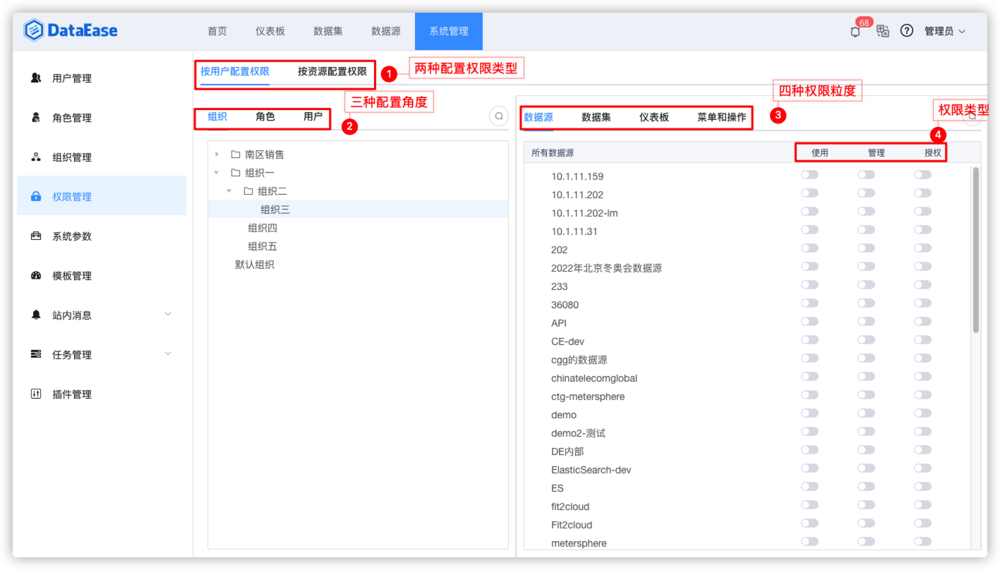

##1 权限介绍
!!! Abstract ""
    支持"按用户配置权限"和"按资源配置权限"两种配置权限类型，下图介绍"按用户配置权限"。  
    支持"组织"、"角色"、"用户"三种维度配置权限，最终用户所具备的权限为所在组织、所拥有的角色及用户本身的权限之和。  
    粒度包括数据源、数据集、仪表板、菜单和操作，粒度对应的权限类型有"使用"、"管理"、"授权"、"行列权限"、"查看"、"导出"6 种。

    **提示：** 不同粒度拥有的权限类型是不同的，例如，数据集拥有"使用"、"管理"、"授权"、"行列权限"权限类型，而仪表板粒度拥有"查看"、"导出"、"管理"、"授权"权限类型。

{ width="900px" }

!!! Abstract ""
    支持"按用户配置权限"和"按资源配置权限"两种配置权限类型，下图介绍"按资源配置权限"。  
    支持"数据源"、"数据集"、"仪表板"、"菜单和操作"四种维度配置权限。最终用户所具备的权限为数据源、数据集、仪表板、菜单和操作配置的权限之和。  
    粒度包括具体的"组织"、"角色"、"用户"三种维度配置权限，权限类型分为"使用"、"管理"、"授权"、"行列权限"、"查看"、"导出"6 种维度。

    **提示：** 不同维度拥有的权限类型内容不同，例如，数据集拥有"使用"、"管理"、"授权"、"行列权限"权限类型，而仪表板粒度拥有"查看"、"导出"、"管理"、"授权"权限类型。

{ width="900px" }

##2 权限维度搜索
!!! Abstract ""
    在权限配置界面，各类信息均支持搜索，例如下图为搜索组织信息。

    **提示：** 其他维度的搜索，如"角色"、"用户"的搜索可参考搜索组织的步骤。

{ width="900px" }

{ width="900px" }

##3 权限类型搜索
!!! Abstract ""
    下图为搜索某一权限粒度信息。

{ width="900px" }

{ width="900px" }

##4 权限类型
!!! Abstract ""    
    针对数据集的权限类型主要有 4 类，从小到大分别是"行列权限"、"使用"、"管理"、"授权"。当配置"管理"权限后，也同时拥有"使用"权限。

    **提示：** 具有"使用"权限的数据集才能调整"行列权限"，预配置"行列权限"还是要先开启"使用"以上的权限。

{ width="900px" }

###配置行权限

!!! Abstract ""    
    下面以给"仪表板大赛"角色配置"冬奥会奖牌榜-Sheet2"数据集的行权限为例。首先是展示"冬奥会奖牌榜-Sheet2"数据集的原始数据和人员的角色信息。

{ width="900px" }

{ width="900px" }

!!! Abstract "" 
    配置的第一种方法操作如下。
{ width="900px" }

{ width="900px" }

!!! Abstract ""    
    配置的第二种方法操作如下。

{ width="900px" }

!!! Abstract ""    
    下面展示给"仪表板大赛"角色配置"冬奥会奖牌榜-Sheet2"数据集的行权限成功后的结果。

{ width="900px" }

###配置列权限

##5 调整权限
!!! Abstract ""
    可以通过点击图中的按钮来开启或关闭权限。可以分别对不同的维度配置不同的权限类型。

    **提示：** 下层级内容会跟随上级的变更而批量变更，例如当关闭"系统管理"的权限时，系统管理下层的相关功能均会自动关闭权限。

{ width="900px" }
