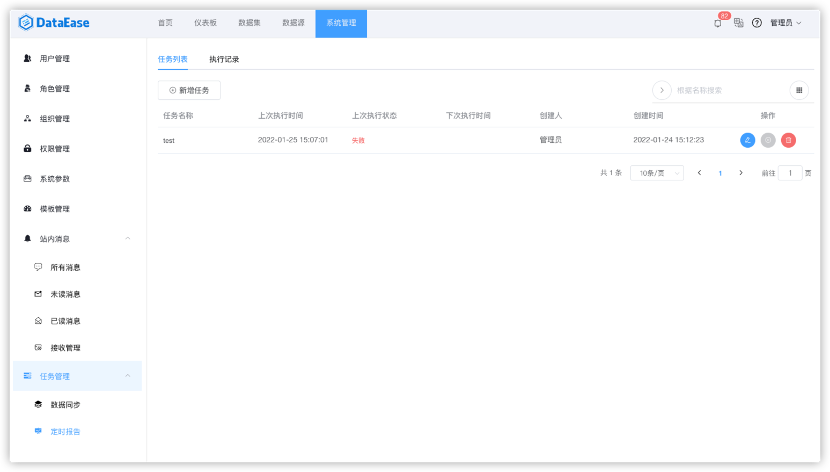
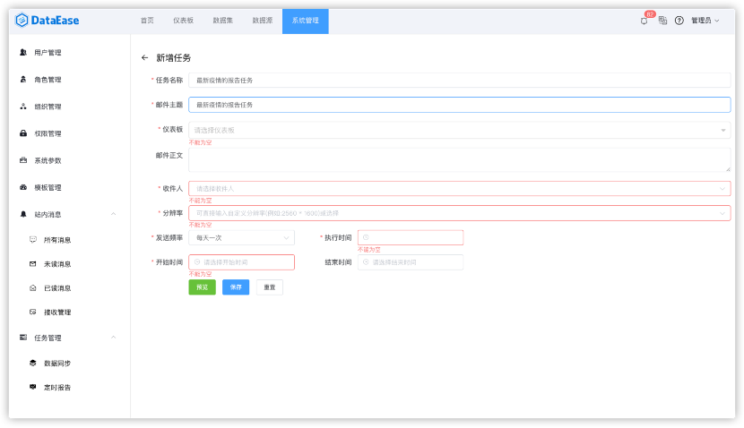
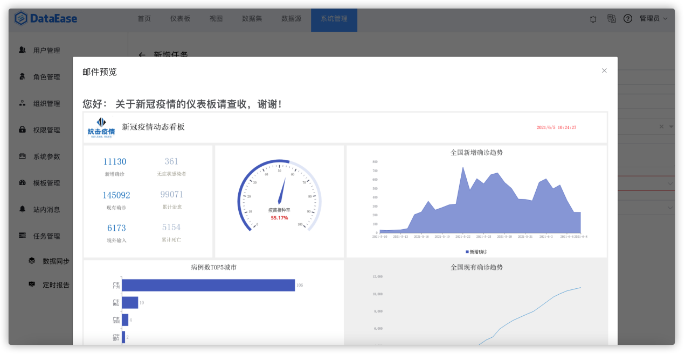
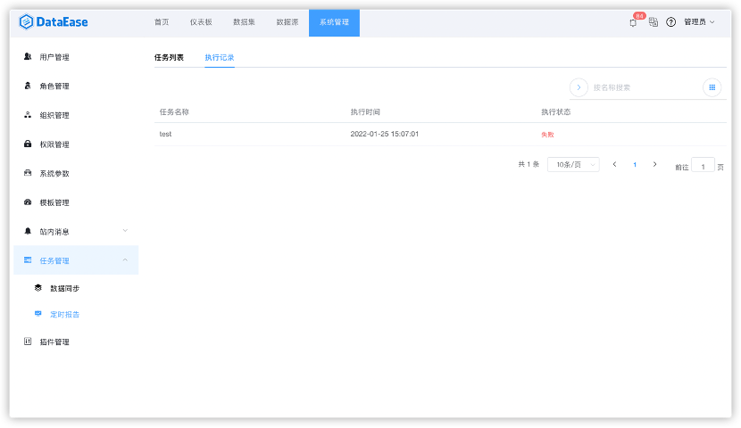

##1 任务列表

!!! Abstract ""
    系统支持给干系人发送邮件的方式定时对特定的仪表板进行报告。选择"系统管理"中"任务管理"的"定时报告"。

{ width="900px" }

###1.1 新增任务
!!! Abstract ""
    点击"新增任务"后需要依次输入需发送的邮件信息和仪表板信息，系统支持点击预览进行邮件信息查看。注意：红色星号标记为必填项。仪表板只能选择一个。

{ width="900px" }

###1.2 预览邮件

!!! Abstract ""
    点击"预览"可以查看邮件效果。

{ width="900px" }

##2 执行记录
!!! Abstract ""
    切换菜单至【执行记录】，查看定时报告的执行记录。

{ width="900px" }
